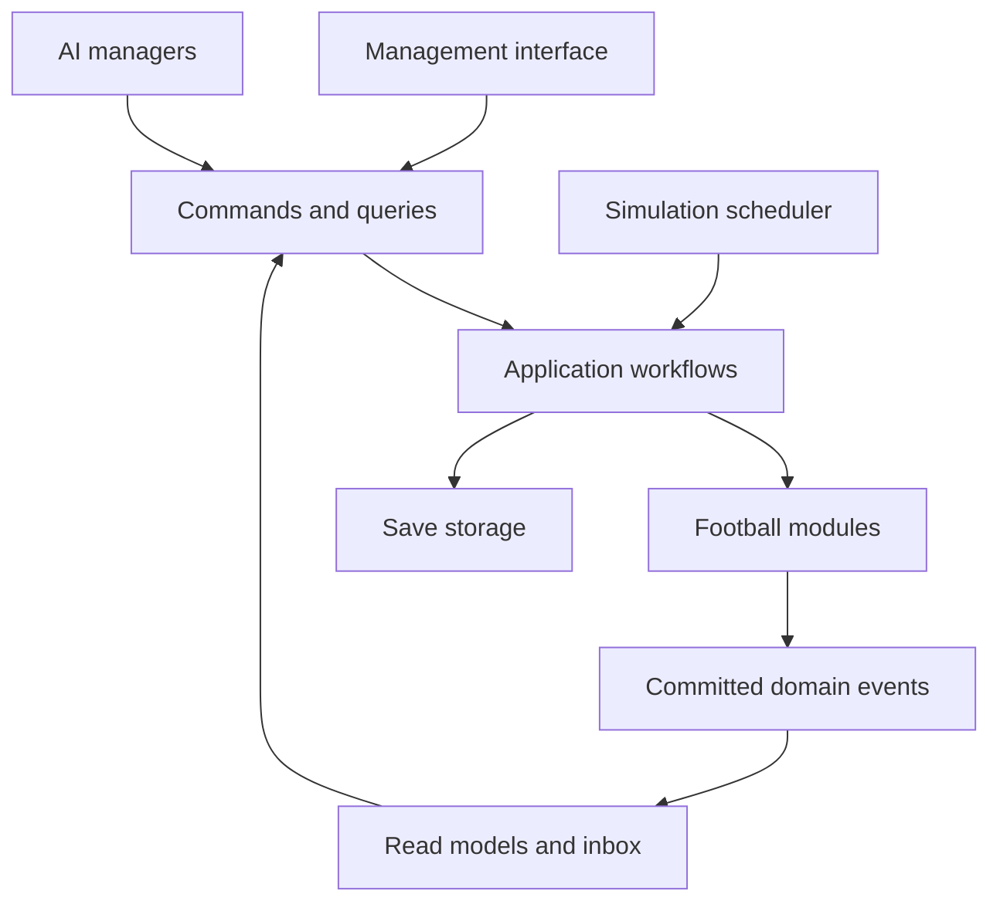

# Football manager game architecture

## Purpose and main decision

Build a headless simulation core as a modular monolith: one application, one authoritative world, and several modules with explicit ownership and typed public contracts. The interface, match presentation, and storage are adapters around that core. Modules can start with simple rules and later replace their internal models without forcing callers to change.

This is a proposed design, not an implementation or a performance benchmark. It assumes a single-player career game, selected simulated leagues, synthetic initial data, and eventual interactive matches. Multiplayer, real-world data licensing, and a production 3D renderer are outside the initial scope. Go is the implementation language for the simulation core. The examples use Go structs, typed numeric IDs, generics for envelopes, and small interfaces at module boundaries. They are architecture fragments: package declarations, imports and some domain type definitions are omitted, and they are not a complete SDK.

The central distinction is between stable football concepts and replaceable calculations. A transfer remains an offer, negotiation, agreement, and completion whether the AI uses a few thresholds or a sophisticated valuation model. A match still accepts a lineup and tactical decisions and produces an authoritative outcome whether it simulates one minute at a time or every movement of the ball.

Stable contracts are an objective, not a promise that every future feature requires no changes. New concepts sometimes need additive fields, new commands, or a new contract version. Preserve meanings and ownership rather than freezing the first data model forever.

## Application structure



Use five layers:

1. **Presentation:** squad screens, inbox, transfer screens, match viewer, settings. Displays read models and submits intentions. Owns no football rules.
2. **Application:** use cases such as Continue, StartMatch, CompleteTransfer, and EndSeason. Coordinates modules and transaction boundaries.
3. **Domain:** the modules below. Owns football facts, rules, and calculations.
4. **Simulation runtime:** game time, scheduled work, deterministic random streams, execution ordering, checkpoints, and background computation.
5. **Infrastructure:** persistence, content loading, logging, and adapters. Does not decide football outcomes.

Run the core without a window. A command-line runner must be able to create a world, simulate seasons, save, load, and print a summary. This makes balancing and debugging possible before building a large interface.

Logical modules should initially be ordinary packages in one process. Avoid separate services, message brokers, and a dynamic plugin framework. They add failure modes without helping the first playable game. A module may contain many internal subsystems later.

## State ownership and module boundaries

Every authoritative fact has exactly one owner. Different modules may own different aspects of the same player or club. They refer to one another by stable IDs and obtain immutable views through public interfaces.

| Module | Authoritative state | Small initial implementation | Later internal expansion |
| --- | --- | --- | --- |
| World registry | Person identities, birth dates, nationalities, clubs, teams, stadium identities | Generated players and clubs | Multiple nationalities, geography, stadium metadata |
| Player development | Attributes, potential model, development history | Few position-related attributes and a monthly growth rule | Skills, aging curves, traits, learning and decline |
| Medical | Condition, injuries, recovery and availability due to health | Condition and a recovery rate | Injury types, recurrence, rehabilitation and workload |
| Squad and tactics | Selection preferences, lineup drafts, roles and tactical instructions | Starting eleven, substitutes, formation, mentality | Units, pressing schemes, set pieces and role familiarity |
| Match | Active sessions, match-local state and completed match records | Minute-based scoring chances and basic incidents | Possession, player decisions, ball physics, detailed statistics |
| Competitions | Competition entries, fixtures, season stages, results, registrations and disciplinary eligibility | One double round-robin league | Cups, playoffs, promotion, continental qualification and varied calendars |
| Employment | Contracts, employer relationships, loans and agreed obligations | Contract end date and weekly salary | Bonuses, clauses, agents, staff and complex loans |
| Transfers | Offers, negotiations, agreements and completion workflow state | Fixed-price bids and accept/reject | Competing bids, installments, clauses and recruitment strategy |
| Finance | Ledger entries, cash, reserved funds and budget allocations | Wages, match income and transfer fees | Debt, sponsorship, taxes, installments and financial rules |
| Training | Training plans, scheduled sessions and completed workload records | One team focus per week | Individual plans, coaches, facilities and periodization |
| Scouting | Club-specific knowledge, assignments and reports | Reveal estimates after an assignment | Regional coverage, uncertainty, bias and knowledge decay |
| Club governance | Objectives, reputation, facilities, manager employment decisions | Board expectation and job status | Budgets, owners, long-term strategy and facility investment |
| People and relationships | Morale, satisfaction, promises and relationships | One morale score and a few causes | Hierarchies, personalities, conflict, media and conversations |
| AI management | Plans, decision memory and priorities for non-user managers | Valid lineup selection and simple bids | Tactical adaptation, squad building, delegation and planning |
| History and communication | Read projections, inbox delivery and historical summaries | Results, standings, notifications and career records | Records, news, awards, biographies and analytics |

The table defines ownership boundaries, not a requirement to implement fifteen packages immediately. For example, development and medical can start in one `players` package with separate internal state. Keep their public views distinct when their responsibilities differ.

**Important distinctions:** Employment owns who employs a player. Competitions owns whether that player is registered and eligible for a particular competition. Squad selection owns which eligible players the manager wants to field. A `ClubID` is not a `TeamID`: reserve and youth teams may belong to the same club. A person can be a player now and a coach later without changing identity.

Standings and a club's displayed roster are derived views, not additional independent owners of results or contracts. Finance owns balances derived from its ledger; other modules never assign a club's cash directly.

Avoid a shared mutable `World` or giant `Player` object accessible to every module. Compose a player profile screen from several read views instead.

## The communication contract

Use three distinct communication mechanisms. They can all be ordinary function calls or in-process queues initially.

| Mechanism | Meaning | Example | Guarantee |
| --- | --- | --- | --- |
| Command | Please attempt a change | SubmitLineup, MakeTransferOffer | Exactly one handler; validated; accepted or rejected explicitly |
| Query | Tell me the current view | GetSquad, GetPlayerReport | No mutation; caller receives a snapshot or immutable data |
| Domain event | A change has committed | TransferCompleted, MatchCompleted | Past tense; stable identity and ordering; consumers handle duplicates |

Keep commands and events strongly typed. Do not replace the domain with a universal `execute(name, arbitraryJson)` function. Shared message envelopes are useful; shared arbitrary payloads are not.

```go
type (
	CommandID uint64
	TaskID    uint64
	EventID   uint64
	ActorID   uint64
	Revision  uint64
)

type ActorKind uint8

const (
	ActorHuman ActorKind = iota + 1
	ActorAI
	ActorSystem
)

type ActorRef struct {
	ID   ActorID
	Kind ActorKind
}

type CommandEnvelope[T any] struct {
	ID               CommandID
	Actor            ActorRef
	ExpectedRevision Revision
	Payload          T
}

type CommandResult[T any] struct {
	Revision Revision
	Value    T
}

// Handlers return (CommandResult[T], error).
// On error, the result is not valid.
type ErrorCode uint16

type CommandError struct {
	Code    ErrorCode
	Message string
}

func (e *CommandError) Error() string { return e.Message }

type CauseKind uint8

const (
	CauseCommand CauseKind = iota + 1
	CauseTask
)

type CauseRef struct {
	ID   uint64
	Kind CauseKind
}

type EventKind uint16

type DomainEvent[T any] struct {
	ID            EventID
	OccurredAt    GameInstant
	WorldRevision Revision
	Sequence      uint64
	Cause         CauseRef
	Kind          EventKind
	SchemaVersion uint16
	Payload       T
}
```

`ExpectedRevision` can initially refer to the whole world. Later use narrower entity revisions if needed. The core supplies authoritative time and identity; a client cannot choose when a command took effect. Retrying a command ID returns the recorded result rather than paying a fee or submitting a bid twice.

Use concrete instantiations such as `CommandEnvelope[MakeTransferOffer]` and `DomainEvent[TransferCompleted]`; the `any` constraint does not turn `Payload` into an interface field. Keep envelopes out of per-player inner loops. Use `(result, error)` returns, with typed command errors for expected rejection and ordinary wrapped errors for infrastructure failures. Decode error codes at the UI adapter. Allocate diagnostic strings on failure paths, rather than on every successful simulation step. Validate cause tags and event kind/payload pairings at dispatch and decoding boundaries. Assign durable enum values explicitly in production; never reorder persisted numeric codes.

Within domain code, use narrow ports such as `EligibilityReader`, `ContractReader`, and `FundsReservation`. Supply them through constructors. The application's composition root supplies implementations. Callers depend on exported contracts, never another module's repository or internal types. Avoid synchronous dependency cycles; move coordination into an application workflow when two modules need each other.

Core invariants must be satisfied in an explicit transaction. Events are appropriate for subsequent consequences and projections, not for hoping that a set of unrelated subscribers will eventually complete an essential operation. Keep event routing visible in one registration table; do not let subscription order secretly determine football rules.

## A complete transfer as a boundary example

The user and AI both submit `MakeTransferOffer`. Transfers validates its negotiation state and schedules the next response. Employment determines contract constraints; Finance checks affordability and can reserve funds. Neither Transfers nor AI edits those modules' tables.

When the parties agree, schedule a completion task for the eligible date. At completion:

1. The application opens a unit of work against a known world revision.
2. Transfers validates that the agreement is still valid and not already completed.
3. Employment stages the old contract termination and the new employment or loan relationship.
4. Finance stages the corresponding club ledger entries and releases reservations. Installment obligations may be scheduled if supported.
5. Competitions validates any required transfer eligibility and stages registration changes when applicable. A signed player can legitimately remain unregistered; do not conflate registration with employment.
6. All owners validate their staged changes. Commit them, the next scheduled tasks, the command result, and the `TransferCompleted` event together.
7. Inbox and roster projections consume the committed event. Pending notifications can be rebuilt or retried.

If any mandatory step fails, none of the staged authoritative changes become visible. Agreeing terms days earlier does not hold a database transaction open: agreement and completion are separate persisted workflow stages, with revalidation at completion.

The initial implementation may complete an accepted offer immediately. The same workflow can later include medical checks, work permits, and agents through explicit states and additional commands.

## Simulation time and the Continue button

Use a discrete-event world clock. Most of the world needs work at scheduled moments, not every rendered frame. Matches have their own internal simulation clock.

Persist a priority queue of serializable task records:

```go
// Logical minutes since the career's epoch; never wall-clock time.
type GameInstant int64

type SimulationPhase uint8
type TaskKind uint16
type TaskPayloadID uint64

type ScheduledTask struct {
	ID            TaskID
	DueAt         GameInstant
	StableOrder   uint64
	PayloadID     TaskPayloadID
	Kind          TaskKind
	SchemaVersion uint16
	Phase         SimulationPhase
}

// Lexicographic comparison; ID is the final tie-breaker.
func taskBefore(a, b ScheduledTask) bool {
	if a.DueAt != b.DueAt {
		return a.DueAt < b.DueAt
	}
	if a.Phase != b.Phase {
		return a.Phase < b.Phase
	}
	if a.StableOrder != b.StableOrder {
		return a.StableOrder < b.StableOrder
	}
	return a.ID < b.ID
}
```

Order tasks by `(DueAt, Phase, StableOrder, ID)`. Do not depend on hash-map iteration or worker completion order. Store task types and payloads, never closures. `PayloadID` refers to a durable typed payload record owned by the relevant module. Save that record, its scheduled task, and its schema version atomically; validate references on load. This keeps the frequently compared queue entries compact without requiring a universal `any` payload. Persist actual payload data, not process-local offsets. A heap of `ScheduledTask` values is a suitable initial implementation. Assign `StableOrder` from a deterministic domain key or sequence, never a worker's completion order. A game instant is an integer logical time coordinate with an explicit calendar conversion; competition and venue rules decide local dates. Avoid the host machine's clock and timezone.

`Continue(until)` advances through tasks until a mandatory user decision, a user match, the requested limit, or a cancellation boundary. Optional inbox items do not always pause the world. Every blocking decision needs an explicit default, expiry, or resolution command so the game cannot become stuck indefinitely.

An initial ordering policy at a shared timestamp can be:

| Phase | Typical work |
| --- | --- |
| Expiries | Contract and registration interval changes, window boundaries |
| Preparation | Recovery, training sessions, scheduled scouting observations |
| Decisions | AI actions, accepted user commands and agreement completion |
| Fixtures | Eligibility validation, lineup locks and match sessions |
| Consequences | Result application, discipline and scheduled competition transitions |
| Presentation | Read-model refresh and user-facing interruption evaluation |

This is a game rule, not an incidental implementation detail. Define contract/window intervals as half-open intervals, for example `[opensAt, closesAt)`, so completion exactly at closing is unambiguous. Future competitions can choose other documented policies. Same-instant work can only schedule into a later phase or the next instant; reject cycles or runaway scheduling with diagnostics.

Schedule wages weekly, development monthly, training on relevant days, and transfers when their next action is due. Do not loop over every object for every minute of the season.

**Simultaneous fixtures:** prepare matches sharing a kickoff from a consistent snapshot. User matches and background matches reach the same logical checkpoints before their results affect other decisions. A first implementation can simulate all such fixtures in stable order while withholding completed results until the cohort finishes. If the player watches one match, its wall-clock duration must not give other clubs extra world time.

## Match engine contract

Separate world simulation, match calculation, and match presentation. A renderer observes the match; it does not decide who scores. Introducing a visual game engine later should not require moving transfer or season rules into scene objects.

Do not make `SimulateMatch(...) Score` the only boundary if in-match decisions are planned. Use a session contract from the start:

```go
type MatchStatus uint8

const (
	MatchRunning MatchStatus = iota + 1
	MatchDecisionRequired
	MatchFinished
)

type MatchEngine interface {
	Start(input *MatchInput, random RandomState) (MatchSession, error)
	Restore(checkpoint MatchCheckpoint) (MatchSession, error)
}

type MatchSession interface {
	Advance(request AdvanceRequest, dst *MatchStepResult) error
	Apply(command MatchCommand) error
	Checkpoint() (MatchCheckpoint, error)
}

type MatchStepResult struct {
	Position MatchPosition
	Status   MatchStatus
	View     MatchView

	// Reusable, caller-owned buffers. The session may append to these.
	Events []MatchEvent

	// Valid only when Status == MatchFinished.
	Outcome MatchOutcome
}

// All RNG state belongs to this session and travels with checkpoints.
// The chosen algorithm defines which words are used.
type RandomState struct {
	Words     [4]uint64
	Algorithm uint16
	Version   uint16
}

type MatchCheckpoint struct {
	EngineID      string
	EngineVersion uint32
	SchemaVersion uint16
	Data          []byte
}
```

These interfaces describe replaceable match engines. Keep the concrete engine's inner update loop, player state, and random generator inside its package; one interface call should perform a meaningful batch of simulation. `Start` accepts a pointer to avoid copying a large input at the call boundary, not to grant shared mutation. It builds owned match state before returning and must not retain aliases to mutable input slices or maps. The caller must not mutate the input during the call. This one-time preparation cost is outside the tight stepping loop.

`Advance` resets logical output fields and slice lengths while retaining reusable buffer capacity, then appends output into `dst`. Any nested slices in `View` and `Outcome` follow the same ownership rule. Returned data must not alias the session's mutable internals. The caller can reuse `dst` for its next synchronous step; asynchronous UI or event consumers need a copy or an explicit buffer ownership handoff. A returned error exposes no usable partial output and must leave the session at its previous valid boundary. Validate first; stage or roll back a failing advance. `Checkpoint` is an infrequent persistence operation and may allocate an independently owned byte slice. The checkpoint envelope records engine and schema compatibility, while its versioned bytes encode match input identity, local state and random state.

Specify the following semantics before implementation:

- `MatchInput`: logically immutable player capabilities, health and condition at kickoff, validated lineups, tactics, venue conditions, competition rules, engine version and capability level. No references to mutable world objects.
- `AdvanceRequest`: advance to the next decision boundary or a target match position. Match position includes period and elapsed time, allowing stoppage time, extra time, and penalties later. A request cannot skip a mandatory decision.
- `MatchCommand`: substitutions and tactical changes. Validated against the session's state and supported capabilities. Takes effect at a defined safe boundary.
- `MatchEvent`: football facts in match-local order, such as goals, cards, substitutions, injuries and periods ending. These may be shown live, but are not yet final world-domain events.
- `MatchOutcome`: match ID, result status, regulation/extra-time/penalty result where relevant, participant minutes, scored goals, cards, injury incidents and workload exposure. Abandoned and awarded matches are separate outcomes; an incomplete session is not a completed result.
- `MatchCheckpoint`: engine ID and version, input identity, private session state, logical position and random state. An engine restores only compatible checkpoints.

The world workflow applies the finished outcome once. Competitions owns the official result and sanctions; Medical owns lasting injury and condition consequences; development can consume playing exposure. The Match module records incidents but never directly writes those other states. Stage required consequences together before exposing the next world revision.

For live injuries, the session immediately changes match-local availability. At finalization, Medical converts those incidents into persistent diagnoses and recovery state. This avoids waiting until full time to remove an injured player while retaining clear world ownership.

| Engine generation | Internal calculation | Preserved external behavior |
| --- | --- | --- |
| First playable | Each minute, sample chances from team strengths, tactics and condition | Session stepping, substitutions, incidents and complete outcome |
| Second | Model possession, zones, passes, shots and individual contributions | Same session controls and normalized outcomes |
| Third | Agent decisions, positioning, collisions and ball motion | Same world integration; optional richer presentation data |

Presentation frames and detailed metrics are optional capabilities. A summary engine need not invent coordinates or pretend to know pass completion. The UI falls back to commentary and summary statistics when detail is absent. Keep “unavailable” distinct from zero.

For background matches, run a session to completion without rendering. A cheaper engine may implement the same contract. Keep one engine pinned for an active session; switching engines requires finishing the session or an explicit compatible conversion. Save at world boundaries first; mid-match saves can be added through the checkpoint seam.

## Selected leagues and world completeness

At new-game creation, choose countries, competitions, and detail levels. Resolve dependencies: lower divisions feeding promotion, domestic cups, and continental competitions need explicit representations even if simplified. Define each rule set's dependency list and reject incomplete configurations.

| Tier | Persistent representation | Simulation policy |
| --- | --- | --- |
| Playable | Full clubs, named squads, contracts, fixtures and histories | User management and detailed decisions |
| Background | Enough named players, contracts and club records to support interaction | Cheaper matches and less frequent AI decisions |
| Aggregate | Coarse clubs, competition results and a reproducible population generator | Seasonal or periodic aggregate updates |

Start with one tier. Add background tiers only when profiling shows a need. Full simulation of selected leagues does not require every league in the world to run in full detail.

Promotion and recruitment across tiers must preserve known IDs and facts. Materialize an aggregate club before a detailed interaction, reconcile its finances and roster with prior aggregate results, and persist the conversion. Do not generate a different player each time the user opens a profile. Promote simulation detail at a documented safe boundary, preferably season transition. Previously observed people and history remain persistent even if their league later runs cheaply.

For the first version, disallow changing the selected league set mid-career. Support that later with explicit activation/deactivation transitions.

World initialization is a pipeline: load definitions, resolve dependencies, create stable identities, populate squads/contracts, initialize finances and staff defaults, instantiate seasons, create fixtures, seed tasks, validate references, then save the initial world.

Season completion is per competition, not one global date. Finalize standings, resolve ties, award prizes, determine qualification, record history, and instantiate the next season only after dependencies are satisfied. Employment, aging, and contract expiry continue on their own dates. A career must be able to reach a second season without resetting club or player identities.

## AI and information access

AI managers use the same public commands and rule validation as the human manager. They do not directly write player attributes, budgets, contracts, or match results. Begin with deterministic heuristics: pick a legal lineup, replace unfit players, bid for weak positions, and remain within a budget.

Separate truth from knowledge. The simulation can know a player's actual attributes and potential while a club sees scouting estimates, report dates, and uncertainty. Human screens and AI decision inputs receive club-scoped observations. Match simulation and development receive the authoritative facts they require.

Do not accidentally give AI recruitment perfect hidden attributes merely because it runs inside the same process. If AI advantages are a deliberate difficulty setting, implement them explicitly in the observation policy. Cheap AI can still operate on the same information contract.

Later AI can split internally into recruitment, tactical preparation, squad planning, and negotiation. All those planners continue to submit the same commands.

## Persistence and deterministic execution

Initially use one save database with module-owned tables and an application-wide transaction boundary. SQLite is a candidate for this arrangement because its transactions support atomic changes to a database; the design does not require a particular storage engine. Never let SQLite-specific rows become the public domain model.

Persist the following together at a safe checkpoint:

- World facts and current logical time.
- Pending tasks, outstanding decisions and workflow stages.
- Random algorithm/version and stream states or counters.
- World revision, command deduplication results and event consumer offsets.
- Content pack identifiers/hashes, rule versions and simulation implementation versions.
- Module schema versions and any active match checkpoint if supported.

Begin with snapshots plus a short committed event journal for projections, diagnostics and recent history. Full event sourcing is not necessary. Save/load correctness must not depend on retaining every training event since the career began. Compact journals only after consumers checkpoint; preserve durable historical records separately.

For an in-memory core, stage mutations in a unit of work, persist atomically, then publish the new immutable revision. On persistence failure, discard staged changes and retain the old revision. Essential derived views must catch up before the next gameplay decision that depends on them; cosmetic news can lag. Readers should see one revision, not a mix of pre- and post-transfer facts.

Use seeded pseudorandom streams partitioned by subsystem and stable context, for example `(worldSeed, engineVersion, matchId)` or `(worldSeed, developmentVersion, playerId, period)`. Use a specified stable seed derivation, not the language's default hash. Scouting draws should not consume the match engine's stream. Partition further when independence matters.

Reproducibility means the same initial state, commands, content, algorithms, execution order, and random state produce the same results. Changing an algorithm can legitimately change future results. Cross-platform bitwise reproducibility requires more care with numeric operations; do not promise it before testing it. Use integer minor units for money and explicit units/ranges for other quantities.

Keep these three versions separate:

1. Public contract version: meaning and shape of module communication.
2. Save schema version: private persisted representation and migrations.
3. Simulation model version: behavioral calculations and random algorithm choices.

Add fields with defined defaults when compatible. Use new event types or major versions for changed meaning. Migrate old saves into new module state with explicit migration functions, preserve the source save, and reject unsupported versions clearly. A compatible interface does not make an old opaque match checkpoint automatically loadable.

## Performance without losing control

Start with one authoritative writer and deterministic sequential execution. Pass compact immutable snapshots into expensive calculations. Introduce worker threads for independent matches or cohorts only after measurement.

Workers calculate proposals; they do not mutate the world. The coordinator validates and commits outputs in stable order. Work based on stale inputs must be rejected, recomputed, or handled by an explicit snapshot policy. Shared competition standings must not be updated in worker completion order.

Load useful indexes once, query batches, and cache derived views by revision. Avoid per-player database calls inside simulation loops. For training and AI, update cohorts or due tasks. Keep internal match detail separate from permanent career data; do not retain every animation frame forever.

Measure season simulation duration, time per module, memory, save size, and Continue latency on a named world configuration. Set numerical budgets after the first playable build rather than claiming an unsupported number of leagues or players.

## Go performance design

The proposed performance strategy is to reduce total simulated work, arrange data for that work, control allocation, and then use bounded parallelism. These are implementation choices to benchmark on this game; none is a measured speedup yet. Keep behavioral contracts stable while allowing each module to choose its own private layout.

### Data layout and access patterns

Use durable typed numeric IDs in public contracts. Internally, translate IDs to dense row indices once before processing a cohort. Keep strings, biographies, negotiation history, and other infrequently used data away from the numeric fields scanned on every update. Do not use a pointer-rich object graph as the default simulation store.

Start with slices of small concrete structs for frequently processed data. A structure of arrays can help kernels that repeatedly touch only one or two fields; a slice of structs can be better when each iteration needs most fields. Benchmark both against representative workloads. Neither layout must be exposed through public contracts.

For example, this simplified Medical implementation owns a dense condition store:

```go
type PlayerID uint64

const maxCondition uint32 = 10_000

type conditionRow struct {
	Player         PlayerID
	Condition      uint16 // 0..10_000, validated on load and mutation
	RecoveryPerDay uint16 // 0..10_000
}

type conditionStore struct {
	rows        []conditionRow
	rowByPlayer map[PlayerID]uint32 // Lookup at boundaries, not in this loop.
}

// Operates on Medical's private staged state for one scheduled day.
// Availability due to injuries remains a separate medical rule.
func (s *conditionStore) recoverDay() {
	for i := range s.rows {
		row := &s.rows[i]
		next := uint32(row.Condition) + uint32(row.RecoveryPerDay)
		if next > maxCondition {
			next = maxCondition
		}
		row.Condition = uint16(next)
	}
}
```

This loop introduces no explicit allocation, map lookup, interface call, or per-player goroutine. It is an example of where concrete storage belongs, not a complete medical model. Production code still validates a task's idempotency and stages the cohort before commit. Add condition thresholds or notifications as a batch of changes, rather than broadcasting an event for every numeric adjustment.

Rows and their indices are private. If deletion uses swap-remove, update the moved player's index. Never persist a row index as a player identity, retain pointers across row compaction, or depend on row order for global randomness. Per-player random streams keep storage reordering from changing development results. Check capacity before narrowing an index to uint32.

Choose numeric widths from domain ranges. Widen intermediate arithmetic before addition or multiplication. Keep money in signed int64 minor units with overflow checks. Do not assume uint16 arithmetic is faster than int arithmetic, or float32 faster than float64; smaller storage and arithmetic throughput are separate questions. Fixed-point values suit bounded attributes when their precision is sufficient; match physics may need floating point. Document units and rounding rules.

### Allocation and ownership

Go slices and maps are reference-bearing values: copying them does not produce an immutable snapshot. Use detached snapshots, an explicit read lifetime, or ownership transfer. Never pass mutable module storage to an asynchronous reader. Save encoders must see a consistent revision.

Preallocate predictable buffers and reuse worker-owned scratch space. Dense data and fewer pointers can reduce GC work; allocation behavior still depends on compiler escape analysis. Inspect profiles and compiler diagnostics instead of assuming that pointer parameters, interfaces, or generics always allocate or never allocate. The [Go GC guide](https://go.dev/doc/gc-guide) explains these tradeoffs.

Prefer one reusable buffer set per match worker before introducing a shared pool. Cap unusually large retained buffers. Use sync.Pool only for optional scratch objects when profiling justifies it; entries may disappear and cannot hold authoritative state. Do not optimize correctness-critical memory with unsafe unless a measured bottleneck remains and you can justify its lifetime and portability constraints.

Staging does not require cloning the entire world for each task. Copy or journal the affected records or chunks, preserve rollback, and publish only a coherent committed revision. Measure snapshot and serialization costs as part of Continue latency.

### Interfaces and concurrency

Put small interfaces around coarse operations: simulate a match segment, compute a training cohort, prepare a transfer, query a squad. Inside a measured hot loop, prefer concrete types and direct calls. The concrete match engine owns its PRNG implementation; the external RandomState is a versioned checkpoint representation. Generics are useful for typed envelopes, but do not guarantee inlining or a faster algorithm.

Begin with one world writer. Parallelize independent matches or computation batches using a bounded worker pool sized through measurements. Do not create a goroutine per player, task, pass, or event. Use channels for work handoff and cancellation when needed, not for every call between football modules.

Each worker owns its input snapshot, PRNG and scratch buffers, and returns one result batch. The coordinator commits by stable task order after the relevant barrier. Disjoint result slots can avoid a shared append or lock in the worker loop. Never concurrently resize the shared result slice. Keep parallel floating-point reductions ordered when reproducibility matters. If profiles show false sharing between worker counters, adjust their placement then.

### Measurement and optimization loop

Create benchmarks for a match, a day of player updates, and a full season with a fixed synthetic world. Reset state outside each timed unit where appropriate, and ensure outputs are consumed. Specify whether input preparation, allocations, and persistence are included. Benchmark the allocation-free stepping target separately from session creation and checkpoints.

Record time, bytes allocated, allocations, resident memory, and end-to-end season throughput. Compare repeated runs on the same toolchain, machine, world size, simulation version, and worker count. Use CPU and allocation profiles to choose the next optimization; use execution traces for scheduling and contention. The [Go diagnostics guide](https://go.dev/doc/diagnostics) describes these tools.

Once the relevant benchmark and command packages exist, these are example commands from the module root:

```sh
go test ./...
go test -race ./...
go test ./internal/matches/simple -run '^$' -bench . -benchmem -count=5
go test ./internal/matches/simple -run '^$' -bench BenchmarkMatch -cpuprofile=cpu.pprof -memprofile=heap.pprof
go tool pprof -top cpu.pprof
go tool pprof -sample_index=alloc_space -top heap.pprof
go test ./internal/matches/simple -gcflags='-m=2'
```

Race-instrumented runs check correctness; do not compare their timings with release benchmarks. Compiler escape reports are clues, not performance measurements.

After representative workloads exist, capture a CPU profile from the headless season runner using runtime/pprof and build with it:

```sh
go build -pgo=season.pprof -o fm-sim ./cmd/simulate
```

The profile should represent the real mix of match, AI, development, and scheduling work. Compare the resulting binary with a build using -pgo=off. [Go PGO](https://go.dev/doc/pgo) can guide compiler optimizations; its benefit depends on the profile and program. Tune GC settings only after measuring allocation and memory pressure, and test with realistic desktop memory limits.

## Content and rules

Keep definitions separate from save state. Versioned content definitions describe countries, competition structures, names, positions, baseline attributes, and tuning constants. Runtime state describes this career's contracts, results, injuries and offers.

Competition definitions need stable IDs, schedule constraints, points and tie-breaking rules, squad rules, and transition policies. Start with typed configuration and a few rule implementations. Do not build an unrestricted rules scripting language immediately.

Validate content when creating a career. Saves pin the effective rule set; installing a new content pack must not silently change an ongoing season. Make rules updates a migration or a deliberate new-season transition. Use synthetic data first so the architecture and gameplay can be developed independently of importing a large real-world database.

## Suggested source layout

```text
cmd/
  game/                  application entry point
  simulate/              headless season simulation and profiling
internal/
  app/                   composition root and cross-module workflows
  core/
    ids/                 typed IDs
    values/              money, time, units
    sim/                 scheduler, transactions and deterministic ordering
  players/               exported API; unexported stores and rules
  medical/
  competitions/
  matches/               match contracts
    simple/              initial engine implementation
    detailed/            later engine implementation
  employment/
  transfers/
  finance/
  training/
  scouting/
  clubs/
  ai/
  readmodels/            squad, standings, inbox
  storage/               codecs, database adapters and migrations
  content/               definitions and validation
  transport/             UI command and query adapters
testdata/                synthetic worlds and old save fixtures
go.mod

Place *_test.go and benchmark files beside the package they exercise.
```

This layout illustrates boundaries, not a mandate to create empty directories. Co-locate code until there is real behavior to separate. Go's `internal` directories restrict imports but do not automatically enforce all module ownership boundaries. Unexport state and repositories, and check the allowed package dependency graph in CI. Keep the module import graph acyclic; define reader interfaces on the consumer side where practical. The shared core must remain small; it must not become a miscellaneous home for football business rules.

Implement the authoritative simulation in Go. Keep UI transport at the edge: direct calls in-process, or a typed adapter if the UI lives in another process. Internal module calls do not need JSON, HTTP or gRPC. Choose a visual game engine for its presentation needs when those needs are concrete; it does not need to host the whole career simulation.

## Build sequence and playable milestones

### First playable season

Use eight fictional clubs with twenty players each, one fourteen-round league, fixed simple contracts, basic condition, a legal lineup, substitutes and two tactical settings. Implement the minute-based match session, simple AI selections, a results table, inbox, Continue, and save/load at world boundaries. Training, scouting, and transfers can be absent from this first slice; do not create fake complex implementations just to populate the architecture.

**Acceptance:** choose a club, change selection and tactics, play all fixtures, see standings and a champion, and resume the same career from a save. The same initial save and command sequence reproduce results under the same simulation version.

### First sustainable career

Add the smallest working versions of training, monthly development/aging, injuries, wages and income, expiring contracts, renewals, free agents, simple transfers, a transfer budget and board feedback. Generate replacement youth cohorts and retire older players so population does not only shrink or grow. AI uses these systems too. Implement season rollover.

**Acceptance:** play at least three consecutive seasons without invalid squads, permanently blocked decisions, negative player counts, duplicated payments, or missing fixtures. Financial difficulty and club failure are allowed outcomes when modeled deliberately.

### Connected football world

Add a second division, promotion/relegation, a cup, scouting uncertainty, staff effects, youth teams and improved club AI. Define cross-competition scheduling and eligibility.

**Acceptance:** clubs can move between divisions, players can move between clubs, and histories remain coherent across those transitions.

### Depth and scale

Improve one subsystem at a time: replace match calculations, deepen negotiation, improve development, add relationships, or add background leagues. Introduce different simulation tiers and parallel computation only when justified by measurements.

**Acceptance:** a replacement implementation passes the same boundary tests; its callers require no changes unless the new feature adds an explicitly versioned concept.

## Verification that protects the architecture

Create a small shared contract suite and a few long-running simulation scenarios. Avoid tests that merely repeat formulas in the implementation.

| Area | Useful verification |
| --- | --- |
| Boundary discipline | Automated imports check prevents access to another module's internals |
| Match engines | Every engine produces legal participant minutes, consistent scores/events, valid substitutions, and serializable checkpoints where supported |
| Continue and stepping | Advancing across a period in one call or through equivalent smaller calls produces the same state if commands and stop conditions are unchanged |
| Persistence | Save/load at a checkpoint gives the same continuation as uninterrupted execution |
| Transfers | A failed completion leaves all mandatory owners unchanged; retry never moves money twice |
| Competitions | Every scheduled fixture is resolved once, points agree with results, and qualification has valid entrants |
| Information access | Club observations exclude hidden truth without appropriate knowledge |
| Population and careers | Multi-season runs preserve IDs and references, replenish cohorts, and terminate all due tasks |
| Statistical balance | Large seeded match batches show plausible trends, such as a stronger team outperforming a weaker one on average |

Contract tests protect semantics as well as field names. For example, a match outcome must say whether a score includes extra time and how a shootout is represented. Treat impossible world states as explicit errors with the responsible task and revision, rather than silently repairing them in unrelated modules.

## Decisions to hold firm

Keep one owner per fact, typed module boundaries, explicit world time, deterministic ordering, transactional cross-module workflows, and a headless simulation core. Let formulas, internal data structures, private subsystems, and rendering technology evolve.

The best first proof is replacing the simple match engine with a richer one while competitions, finance, career saves at world boundaries, and the management UI still work through the same contracts.

## Supporting references

These references support the general mechanisms; the module decomposition and football workflows above are design recommendations for this project.

- Robert Nystrom, [Event Queue](https://gameprogrammingpatterns.com/event-queue.html): queued communication and the coupling risks of a global event bus.
- Robert Nystrom, [Game Loop](https://gameprogrammingpatterns.com/game-loop.html): separating progression of game state from input and presentation timing.
- SQLite, [Atomic Commit](https://www.sqlite.org/atomiccommit.html) and [Transactions](https://www.sqlite.org/lang_transaction.html): transactional storage semantics supporting the proposed save boundary.
- Go, [Language specification](https://go.dev/ref/spec): slice backing arrays, value semantics, and numeric types.
- Go, [Garbage collector guide](https://go.dev/doc/gc-guide): allocation, pointer scanning, and escape analysis.
- Go, [Diagnostics](https://go.dev/doc/diagnostics) and [Profile-guided optimization](https://go.dev/doc/pgo): measurement and compiler optimization workflow.
